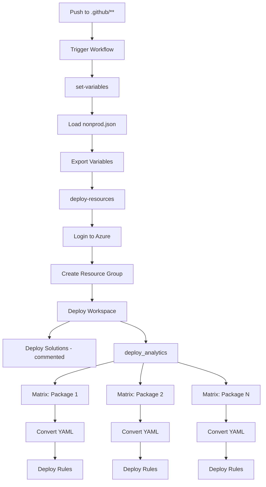

# GitHub Actions Workflows Reference

## Overview

This repository contains two GitHub Actions workflows that automate Microsoft Sentinel deployment and validation.

## Workflows

### 1. Deploy Sentinel (`deploy-sentinel.yml`)

**File:** `.github/workflows/deploy-sentinel.yml`

#### Trigger Configuration

```yaml
on:
  push:
    paths:
      - '.github/**'
```

**Triggers when:**
- Changes pushed to any file in `.github/` directory
- Manual workflow dispatch (via GitHub UI)

**Does NOT trigger on:**
- Changes to `packages/` (handled by analytics.yaml)
- Changes to `resources/` directly
- Changes to `samples/`

#### Workflow Structure

```
deploy-sentinel.yml
├── Job 1: set-variables
│   ├── Load configuration from JSON
│   └── Export as workflow outputs
├── Job 2: deploy-resources (depends on: set-variables)
│   ├── Create Resource Group
│   ├── Deploy Log Analytics Workspace
│   └── Deploy Sentinel Solutions (commented out)
└── Job 3: deploy_analytics (depends on: deploy-resources, set-variables)
    ├── Matrix strategy (parallel deployment)
    ├── Convert YAML to ARM
    └── Deploy analytics rules
```

#### Job Details

##### Job 1: set-variables

**Purpose:** Load environment configuration and make available to other jobs

**Runner:** `ubuntu-latest`

**Steps:**

1. **Checkout Code**
   ```yaml
   - uses: actions/checkout@main
   ```
   - Clones repository
   - No parameters needed

2. **Set Variables**
   ```yaml
   - uses: SecureHats/JsonTo-Variable@v0.1.3
     with:
       filePath: './environments/nonprod.json'
       outputs: true
   ```
   - **Action:** SecureHats/JsonTo-Variable
   - **Version:** v0.1.3
   - **Input:** JSON configuration file
   - **Output:** Environment variables and job outputs

**Outputs:**

| Output | Source | Description |
|--------|--------|-------------|
| `customerSolutions` | `packages_customerSolutions` | Array of solution packages |
| `sentinelResourceGroup` | `LogAnalytics_sentinelResourceGroup` | Resource group name |
| `workspaceName` | `LogAnalytics_workspaceName` | Workspace name |
| `location` | `LogAnalytics_location` | Azure region |
| `solutionsPath` | `packages_solutionsPath` | Path to packages |
| `pricingTierLogAnalytics` | `LogAnalytics_pricingTierLogAnalytics` | Pricing tier |
| `retentionInDays` | `LogAnalytics_retentionInDays` | Retention period |
| `enableBehaviorAnalyticsInsights` | `LogAnalytics_enableBehaviorAnalyticsInsights` | Feature flag |
| `enableLogicAppsManagementInsights` | `LogAnalytics_enableLogicAppsManagementInsights` | Feature flag |
| `enableDnsAnalytics` | `LogAnalytics_enableDnsAnalytics` | Feature flag |
| `enableContainerInsights` | `LogAnalytics_enableContainerInsights` | Feature flag |
| `enableVMInsights` | `LogAnalytics_enableVMInsights` | Feature flag |
| `enableWindowsFirewall` | `LogAnalytics_enableWindowsFirewall` | Feature flag |

##### Job 2: deploy-resources

**Purpose:** Deploy Azure infrastructure components

**Runner:** `ubuntu-latest`

**Dependencies:** `set-variables`

**Steps:**

1. **Azure Login**
   ```yaml
   - uses: azure/login@v1
     with:
       creds: ${{ secrets.AZURE_CREDENTIALS }}
   ```
   - **Required Secret:** `AZURE_CREDENTIALS`
   - **Format:** JSON with clientId, clientSecret, subscriptionId, tenantId

2. **Checkout Code**
   ```yaml
   - uses: actions/checkout@main
   ```

3. **Create Resource Group**
   ```yaml
   - uses: azure/arm-deploy@v1
     with:
       subscriptionId: ${{ secrets.AZURE_SUBSCRIPTION }}
       scope: 'subscription'
       region: ${{ needs.set-variables.outputs.location }}
       template: "./resources/resourcegroup.bicep"
       parameters: |
         resourceGroupName=${{ needs.set-variables.outputs.sentinelResourceGroup }}
         location=${{ needs.set-variables.outputs.location }}
   ```
   
   **Details:**
   - **Deployment Scope:** Subscription-level
   - **Template:** `resources/resourcegroup.bicep`
   - **Parameters:**
     - `resourceGroupName` - From configuration
     - `location` - From configuration
   - **Required Permission:** Contributor at subscription level

4. **Create Log Analytics Workspace**
   ```yaml
   - uses: azure/arm-deploy@v1
     with:
       subscriptionId: ${{ secrets.AZURE_SUBSCRIPTION }}
       resourceGroupName: ${{ needs.set-variables.outputs.sentinelResourceGroup }}
       template: "./resources/workspace.bicep"
       parameters: |
         workspaceName=${{ needs.set-variables.outputs.workspaceName }}
         location=${{ needs.set-variables.outputs.location }}
         enableBehaviorAnalyticsInsights=${{ needs.set-variables.outputs.enableBehaviorAnalyticsInsights }}
         ...
   ```
   
   **Details:**
   - **Deployment Scope:** Resource group
   - **Template:** `resources/workspace.bicep`
   - **Deploys:**
     - Log Analytics Workspace
     - Microsoft Sentinel solution
     - Optional Azure Monitor solutions
     - Sample incident (for testing)

5. **Create Sentinel Solutions** (Currently commented out)
   ```yaml
   # - uses: azure/arm-deploy@v1
   #   with:
   #     template: "./resources/solutions.bicep"
   ```
   
   **Note:** Uncomment to enable additional solutions deployment

##### Job 3: deploy_analytics

**Purpose:** Deploy analytics rules from packages

**Runner:** `ubuntu-latest`

**Dependencies:** `deploy-resources`, `set-variables`

**Strategy:**

```yaml
strategy:
  matrix:
    package: ${{ fromJSON(needs.set-variables.outputs.customerSolutions) }}
```

**Matrix Deployment:**
- Runs in parallel for each package
- Example: If `customerSolutions = ["keyvault", "azure-ad"]`, creates 2 parallel jobs
- Each job processes one package independently

**Error Handling:**

```yaml
continue-on-error: true
```
- Individual package failures don't stop other deployments
- Review logs to identify failed packages

**Steps:**

1. **Checkout Code**
   ```yaml
   - uses: actions/checkout@main
   ```

2. **Convert YAML to ARM**
   ```yaml
   - uses: SecureHats/YamlTo-Arm@v0.1.7
     with:
       filesPath: ./${{ needs.set-variables.outputs.solutionsPath }}/${{ matrix.package }}
       outputPath: ./${{ needs.set-variables.outputs.solutionsPath }}/${{ matrix.package }}
   ```
   
   **Details:**
   - **Action:** SecureHats/YamlTo-Arm
   - **Version:** v0.1.7
   - **Input:** YAML analytics rules
   - **Output:** ARM template (`deployment.json`)
   - **Process:**
     1. Reads all `*.yaml` files in package directory
     2. Validates YAML structure
     3. Converts to ARM template
     4. Writes `deployment.json` to output path

3. **Azure Login**
   ```yaml
   - uses: azure/login@v1
     with:
       creds: ${{ secrets.AZURE_CREDENTIALS }}
   ```

4. **Deploy Analytics**
   ```yaml
   - uses: azure/arm-deploy@v1
     with:
       subscriptionId: ${{ secrets.AZURE_SUBSCRIPTION }}
       resourceGroupName: ${{ needs.set-variables.outputs.sentinelResourceGroup }}
       template: ./${{ needs.set-variables.outputs.solutionsPath }}/${{ matrix.package }}/deployment.json
       parameters: workspace=${{ needs.set-variables.outputs.workspaceName }}
   ```
   
   **Details:**
   - Deploys generated ARM template
   - Creates analytics rules in Sentinel workspace
   - Parameters passed: workspace name

#### Secrets Required

| Secret Name | Description | Format | How to Get |
|-------------|-------------|--------|------------|
| `AZURE_CREDENTIALS` | Service Principal auth | JSON | `az ad sp create-for-rbac --sdk-auth` |
| `AZURE_SUBSCRIPTION` | Subscription ID | GUID | `az account show --query id` |

#### Permissions Required

Service Principal needs:

1. **Subscription Level:**
   - `Contributor` role
   - Required for resource group creation

2. **Resource Group Level:**
   - `Contributor` role (inherited)
   - Required for resource deployment

3. **Log Analytics Workspace Level:**
   - `Log Analytics Contributor` (inherited)
   - Required for Sentinel configuration

#### Execution Flow



---

### 2. Analytics Validation (`analytics.yaml`)

**File:** `.github/workflows/analytics.yaml`

#### Trigger Configuration

```yaml
on:
  push:
    paths:
      - 'packages/**'
```

**Triggers when:**
- Changes pushed to any file in `packages/` directory
- New analytics rules added
- Existing rules modified

**Does NOT trigger on:**
- Changes to `.github/`
- Changes to `resources/`
- Changes to `samples/`

#### Workflow Structure

```
analytics.yaml
└── Job: pester-test
    ├── Validate Deprecated KQL
    └── Validate Sentinel Analytics Rules
```

#### Job Details

##### Job: pester-test

**Purpose:** Validate analytics rules for syntax and quality

**Runner:** `ubuntu-latest`

**Steps:**

1. **Check out Repository**
   ```yaml
   - uses: actions/checkout@v3
   ```
   - Clones repository
   - Uses v3 (newer than deploy workflow)

2. **Validate Deprecated KQL Values**
   ```yaml
   - uses: SecureHats/kusto-alias@v0.2.0
     with:
       filesPath: ./packages/**
       logLevel: Detailed
   ```
   
   **Details:**
   - **Action:** SecureHats/kusto-alias
   - **Version:** v0.2.0
   - **Purpose:** Check for deprecated KQL functions
   - **Log Level:** Detailed (verbose output)
   
   **Checks:**
   - Deprecated function usage
   - KQL syntax errors
   - Query performance issues
   
   **Common Deprecations:**
   | Old Function | New Function | Reason |
   |--------------|--------------|--------|
   | `todynamic()` | `parse_json()` | Better naming |
   | `extractjson()` | `parse_json()` | Consolidated |
   | `makeset()` | `make_set()` | Naming convention |
   | `makelist()` | `make_list()` | Naming convention |

3. **Validate Sentinel Analytics Rules**
   ```yaml
   - uses: SecureHats/validate-detections@v1.5
     with:
       filesPath: ./packages/**
       logLevel: Detailed
   ```
   
   **Details:**
   - **Action:** SecureHats/validate-detections
   - **Version:** v1.5
   - **Purpose:** Validate YAML structure and content
   - **Log Level:** Detailed
   
   **Validations:**
   - Required fields present
   - Valid severity levels
   - Entity mappings correct
   - MITRE ATT&CK tactics valid
   - Query syntax valid
   - Data connector references valid
   
   **Required Fields:**
   ```yaml
   id: <guid>
   name: <string>
   description: <string>
   severity: High|Medium|Low|Informational
   status: Available|Installed
   requiredDataConnectors: <array>
   queryFrequency: <duration>
   queryPeriod: <duration>
   triggerOperator: gt|lt|eq|ne
   triggerThreshold: <number>
   query: <KQL>
   ```

#### Validation Results

**Success:**
- All checks pass
- Green checkmark on commit
- Safe to merge/deploy

**Failure:**
- Detailed error messages in logs
- Red X on commit
- Fix issues before deploying

**Example Error Output:**

```
Error: Deprecated function found in packages/keyvault/rule1.yaml
  Line 15: todynamic() is deprecated, use parse_json()

Error: Missing required field in packages/azure-ad/rule2.yaml
  Field: entityMappings
  Required for proper incident correlation

Warning: Query may have performance issues
  File: packages/azure-firewall/rule3.yaml
  Issue: Full table scan without time filter
```

#### Best Practices

1. **Run Locally Before Push:**
   ```bash
   # Install validation tools
   # Check YAML syntax
   yamllint packages/**/*.yaml
   
   # Test KQL in workspace
   # Copy-paste query to Log Analytics
   ```

2. **Fix Deprecated Functions:**
   - Review validation output
   - Update KQL queries
   - Test in workspace
   - Commit fixes

3. **Required Field Checklist:**
   - ✅ Unique GUID for `id`
   - ✅ Descriptive `name`
   - ✅ Detailed `description`
   - ✅ Appropriate `severity`
   - ✅ Valid `tactics` and `techniques`
   - ✅ Entity mappings for correlation
   - ✅ Tested KQL query

---

## Workflow Comparison

| Feature | deploy-sentinel.yml | analytics.yaml |
|---------|-------------------|----------------|
| **Trigger** | `.github/**` changes | `packages/**` changes |
| **Purpose** | Deploy infrastructure | Validate rules |
| **Jobs** | 3 (sequential + matrix) | 1 |
| **Azure Login** | Yes | No |
| **Secrets Required** | Yes | No |
| **Deploys Resources** | Yes | No |
| **Validates Rules** | No | Yes |
| **Runtime** | 5-10 minutes | 1-2 minutes |

---

## Customization Examples

### Example 1: Add Production Environment

Create new workflow for production:

```yaml
# .github/workflows/deploy-sentinel-prod.yml
name: Deploy Sentinel - Production
on:
  push:
    branches:
      - main
    paths:
      - 'environments/prod.json'
      
jobs:
  set-variables:
    # Same as deploy-sentinel.yml but use prod.json
    - uses: SecureHats/JsonTo-Variable@v0.1.3
      with:
        filePath: './environments/prod.json'
        
  # Rest of jobs same as deploy-sentinel.yml
```

### Example 2: Add Approval for Production

```yaml
# In deploy-sentinel-prod.yml
jobs:
  deploy-resources:
    needs: set-variables
    environment:
      name: production
      url: https://portal.azure.com
    # Rest of job definition
```

Then configure environment protection rules in GitHub Settings.

### Example 3: Slack Notifications

Add to both workflows:

```yaml
jobs:
  notify:
    runs-on: ubuntu-latest
    if: always()
    needs: [deploy-resources, deploy_analytics]
    steps:
      - name: Slack Notification
        uses: 8398a7/action-slack@v3
        with:
          status: ${{ job.status }}
          webhook_url: ${{ secrets.SLACK_WEBHOOK }}
```

### Example 4: Cost Estimation

Add before deployment:

```yaml
- name: Estimate Costs
  uses: azure/arm-deploy@v1
  with:
    scope: subscription
    region: ${{ needs.set-variables.outputs.location }}
    template: ./resources/workspace.bicep
    additionalArguments: --what-if
```

---

## Troubleshooting Workflows

### Check Workflow Logs

1. Go to **Actions** tab
2. Select workflow run
3. Click on failed job
4. Expand failed step
5. Review error messages

### Common Issues

#### Issue: Workflow not triggering

**Check:**
- Path filters in `on.push.paths`
- Branch protection rules
- Workflow permissions

**Solution:**
```yaml
# Ensure correct path
on:
  push:
    paths:
      - '.github/**'  # Must match exactly
```

#### Issue: Variables not passing between jobs

**Check:**
- Job dependencies (`needs:`)
- Output definitions
- Variable references

**Solution:**
```yaml
# In first job
outputs:
  myvar: ${{ env.MY_VAR }}
  
# In second job
needs: first-job
steps:
  - run: echo ${{ needs.first-job.outputs.myvar }}
```

#### Issue: Matrix deployment all failing

**Check:**
- JSON format of customerSolutions
- Package directory structure
- YAML file syntax

**Solution:**
```bash
# Validate JSON
echo '${{ needs.set-variables.outputs.customerSolutions }}' | jq .

# Check directory structure
ls -la packages/*/
```

---

## Performance Optimization

### Caching Dependencies

Add to workflows:

```yaml
- uses: actions/cache@v3
  with:
    path: ~/.azure
    key: ${{ runner.os }}-azure-${{ hashFiles('**/package.json') }}
```

### Parallel Execution

Current setup:
- `deploy_analytics` uses matrix for parallel deployment
- Each package deploys independently

To add more parallelism:

```yaml
strategy:
  matrix:
    package: ${{ fromJSON(needs.set-variables.outputs.customerSolutions) }}
  max-parallel: 5  # Limit concurrent jobs
```

### Skip Redundant Steps

```yaml
- name: Deploy Resources
  if: github.event_name == 'push'  # Skip on PR
```

---

## Security Best Practices

1. **Never log secrets:**
   ```yaml
   - run: echo "Subscription: ${{ secrets.AZURE_SUBSCRIPTION }}"
     # DON'T DO THIS
   ```

2. **Use environment protection:**
   ```yaml
   environment:
     name: production
     # Requires approval in Settings
   ```

3. **Limit permissions:**
   ```yaml
   permissions:
     contents: read
     id-token: write
   ```

4. **Rotate secrets regularly:**
   - Update service principal credentials every 90 days
   - Use Azure Key Vault for sensitive data

---

## Additional Resources

- [GitHub Actions Documentation](https://docs.github.com/actions)
- [Azure ARM Deploy Action](https://github.com/marketplace/actions/deploy-azure-resource-manager-arm-template)
- [SecureHats Actions](https://github.com/marketplace?query=securehats)
- [Workflow Syntax](https://docs.github.com/en/actions/using-workflows/workflow-syntax-for-github-actions)

---

**Last Updated:** October 23, 2025  
**Version:** 1.0.0
